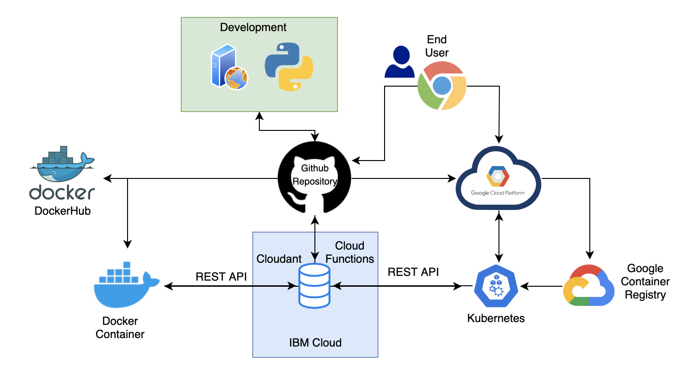
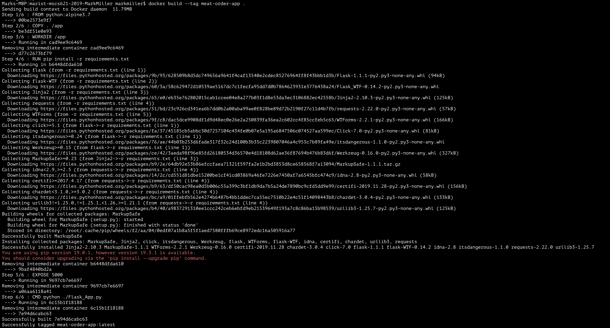
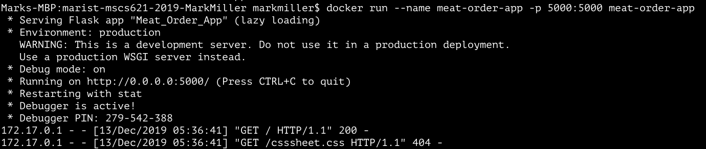
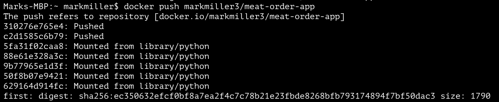
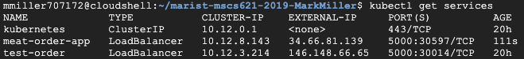

 # Malafy's Meat Processing LLC Order Assistant Application
 ------------------------------------------------------------------
This application is desgined to aid a customer of Malafys Meat Processing by providing a simple and easy way to order meat. The project idea was given to me by a fellow professor who wanted an easier way of ordering the large quantities of meat he had. Handling large quanuties of meat makes it a tedious process by hand. Thats where the Malafy's Meat Order Assistant helps out.  
 
 > Malafys Meat Processing has has a complex way for customers to order meat. The interactive web application was geared toward simplifying the ordering process. This web app was built from stratch using Python Flask and HTML. It utilizies multiple different modules to complete the many tasks within the application.
 
 >The web application completes task such as calculating the total price, price per item, number of pounds ordered, and supply an easy to understand summary of your order. 
 
-------------------------------------------------------------------
## Dependencies
1. IBM Cloud Account
2. Google Cloud Account
3. Docker

-------------------------------------------------------------------
## Architecture Diagram


-------------------------------------------------------------------
## Prerequisites
#### Signup for Cloud Services
The two cloud services used are Google Cloud and IBM Cloud. Please sign up for the free trials on both services.
 - [Google Cloud](https://cloud.google.com/) 
 - [IBM Cloud](https://www.ibm.com/cloud)
 

#### Ensure Docker is Installed on your Device
Docker is used throught this setup, please ensure it is installed on your device.
- [Docker Installation](https://docs.docker.com/v17.09/engine/installation/)

------------------------------------------------------------------
## Configurations
### The first step in recreating this project is to setup a Database on IBM Cloud Cloudant

***Note: This is only if you want to recreate the project, if you are downloading the provided repository you can skip to the deployment section.***

If you want to follow a complete guide on creating a Cloudant Database, follow the guide [here](https://cloud.ibm.com/docs/tutorials?topic=solution-tutorials-serverless-api-webapp)

>The guide above will provide a high level overview of creating the cloudant database, creating the neccessary functions, and creating the api. Below is a quick overview of this guide.

#### IBM Cloudant and Functions Configuration
Creating the Cloudant Database:
1. Navigate to Cloudant Database (you may need to search for it)
2. Start by creating a Cloudant database
    - Give the database a name like **Meat-Items-db**
    - Select the region you would like
    - Ensure you are using the Lite plan (free tier)
    - Make sure you use **Use both legacy credentials and IAM** for Available authentication methods
3. Create the Cloudant Database

Create Service Credentials for Database:
1. Under the Database we just created, click on **Service Credentials**
2. Click **New Credential**
3. Click **Add**

Creating a Cloud Function:
1. Navigate to Cloud Functions
2. On the pane to the left, click **Actions** then **Create**
3. Create the action with a name like **Prepare-Meat-Items**
4. Select **Node.js** as the Runtime
5. Delete the given code and insert the code below:
```shell
function main(params) {
  if (!params.id || !params.item_name || params.price) {
    return Promise.reject({ error: 'No item Found'});
  }

  return {
    doc: {
      createdAt: new Date(),
       id: params.id,
       item_name: params.item_name,
       price: params.price
    }
  };
}
```
6. Click Save

Add another Action to the Sequence:
1. Click on **Enclosing Sequences** in the left pane
2. Click **Add to Sequence**
3. Enter a name for the sequence like **Meat-Items-Sequence**
4. Click **Create and Add**

Adding a Second Action to the Sequence:
1. Click on the recent action we created above (**Meat-Items-Sequence**) and click **Add**
2. Select **Use Public**,**Cloudant** and choose **create document** under **Actions**
3. Click create **New Binding**
4. Give a name like **Meat-Item-Binding**
5. For Cloud Instance choose **Input Own Credentials**
6. Fill in your credentials for database (see next section for instructions on how to get there)

Accessing Database Credentials for Second Action in the Sequence:
1. Go to **Resource List** in the left hand pane
2. Click **Service**, **Meat-Items-db**
3. Click **Service Credentials** in the left pane
4. Click **view crednetials** service-credentials-1
5. Insert the **Host, Password, and Username** from credentials into the last step above
6. Insert **Database** which is the name of the cloudant database

Create Sequence of Actions to Retrive the Entries:
1. Under **Functions** click **Create** new **Node.js** action under default package
2. Create a name for the action like **Meat-Items-Input**
3. Delete the given code and insert the code below
```shell
function main(params) {
  return {
    params: {
      include_docs: true
    }
  };
}
```
4. Click **Save**

Add an Action to a Sequence:
1. Click **Enclosing Sequences, Add to Sequence** then **Create New**
2. Give an **Action Name** like **Read-Meat-Items-Sequence**
3. Click **Create and Add**
4. Click on the sequence **Read-Meat-Items-Sequence** we just created
5. Click **Add**
6. Under **My Bindings** choose **Meat-Item-Binding** and click **Add** 
7. Click **Add** again
8. Under **Create New** enter a name like **Format-Meat-Items**, then click **Create and Add**
9. Click on the **Format-Meat-Items** and replace the code given with the code below
```shell
const md5 = require('spark-md5');

function main(params) {
  return {
    entries: params.rows.map((row) => { return {
      id: row.doc.id,
      item_name: row.doc.item_name,
      price: row.doc.price
    }})
  };
}
```
10. Click on **Save**

Invoke the Sequence:
1. Click on **Actions** then click on the sequence **Read-Meat-Items-Sequence**
2. Click on **Save** and **Invoke**

Create the API:
1. Go to **Actions**
2. Click on the sequence **Read-Meat-Items-Sequence**
3. Next to name click **Web Action**, check **Enable as Web Action** and then **Save**
4. Do the same as above for the sequence **Meat-Items-Sequence**
5. Go to **APIs** under Functions
6. Click **Create API**
7. Set the name such as **Meat-Items** and the base path to /Meat-Items
8. Click **Create operation**
9. Set path to **/entries** set verb to **GET**
10. Select the action **Read-Meat-Items-Sequence**
11. Click **Create operation**
12. Set path to **/entries** set verb to **PUT**
13. Select the action **Meat-Items-Sequence**
14. Save and expose the API

Click [here](https://portal.us-south.apigw.cloud.ibm.com/portal?artifactId=9e1186cf-5f8c-407e-9763-7ba1ed99fffd) for a insturctions to post your entries to the database.

Please Note: If you create a new database you must replace the API url in the api_call.py file with the new url you just created.

----------------------------------------------------------------------------------------
## Deployment - Local 
>This section is going to walkthrough the steps need to deploy the web application locally on your device. This section will also cover posting the container to docker hub.

1. Run a git clone of this repository to get access to all the required files you will need:
```shell
git clone https://markmiller3/marist-mscs621-2019-MarkMiller.git
```
2. Once the git clone has finsihed change directories to directory you cloned the repository
3. From inside of the repository directory, run the following command:
```shell
docker build --tag meat-order-app .
```
> This will build the docker image with the given tag meat-order-app. You can use any name for the image.

The output will look similar to:


4. To run the docker image execute the following command:
```shell
docker run --name meat-order-app -p 5000:5000 meat-order-app
```
>This command will run the built image from the previous step and will now be accessible on by entering the url http://0.0.0.0:5000/. 
> The --name is setting the name of the container and -p is setting to port of the container.

The output will look similar to:


5. To look at the container running we can run:
```shell
docker container ls
```
6. To pause a docker container we can run:
```shell
docker container pause container-name
```
> This will pause the container with the given name container-name

7. To stop a docker container execute:
```shell
docker container stop container-name
```
> This will stop the running container with the given name container-name

#### Pushing the Docker Image to Dockerhub
1. Once we created the image, we can view the image by running:
```shell
docker images
```
>This will show the images we have created along with the image-id, which is important in pushing the image to docker hub.

2. Login into docker hub by issuing the following command:
```shell
docker login --username=yourusername
```
>Yourusername is the username of your docker hub. After executing this it will ask for a password. Input your password and it should return 'successful login'.

3. Once we login we have to tag the docker image, this requires finding the image-id from issuing docker images. To tag the image run the command below:
```shell
docker tag docker-id1234 yourusername/meat-order-app:first
```
> This will tag the image and allow us to push the iamge to dockerhub. Input the docker image docker-id for docker-id1234 and replace yourusername with your docker hub username.

4. To push the image to docker hub run:
```shell
docker push yourusername/meat-order-app
```
Everything above should return a similar output to:


You can view the docker hub I published while creating this project at [Docker Hub](https://hub.docker.com/repository/docker/markmiller3/meat-order-app)

--------------------------------------------------------------------------------------
## Deployment - Running the Application in Google Cloud
> This section will go over how to deploy a kubernetes cluster, post to google container registery, and access it once setup.

1. Create a new Project in the Google Cloud Platform:
   - Give it a name like **Meat-Order-Application**
   - This will take a minute or two to finish
   
2. Click the dropdown next to Google Cloud Platform and click your newly created Project

3. Create a Kubernetes Cluster underneath this Project:
   - Give the cluster a name **meat-application-cluster**
   - Give it a zone like **us-east1-b**
   - Leave everything else the same
   - Click **Create** to create cluster
   - Wait until the cluster is complete
   
4. Once the cluster has finshed click **connect** then **run in Cloud Shell**:
> This will bring up the Cloud Shell where we can interact with the cluster and create our kubernetes pods

5. Run the git clone command so we can access the repository within the cloud shell:
```shell
git clone https://github.com/markmiller3/marist-mscs621-2019-MarkMiller.git
```
6. Change Directory to the Repoistory Directory

7. To build the docker image we will run the command below:
```shell
docker build --tag meat-order-app .
```

8. In order to push and pull images we need to configure docker to use gcloud command line tool to authenticate requests to the Container Registry. To do this run the command:
```shell
gcloud auth configure-docker
```

10. In order to use the docker image in kubernetes we need to add it to the Container Registry. Run the code below:
```shell
docker tag meat-order-app gcr.io/[PROJECT-ID]/meat-order-app
```
>This will tag the docker image so we can push it to the container Registry. Be sure to change the [PROJECT-ID] to your specific projects id. For this project my project-id was meat-order-application. 
The command for this project looked like 'docker tag meat-order-app gcr.io/meat-order-application/meat-order-app'

11. Next we need to push the image to the container Register. Run the command below to push it:
```shell
docker push gcr.io/meat-order-application/meat-order-app
```
>This command will push the image to the container register so we can later use it in our kubernetes cluster

12. Now we need to create our deployment for kubernetes. Run the following command to create it:
```shell
kubectl create deployment meat-order-app --image=gcr.io/meat-order-application/meat-order-app
```
> With the creation of the deployment and the image set to the Docker Registry we set, we can now expose the deployment.

13. To expose the deployment we need to run the command below:
```shell
kubectl expose deployment meat-order-app --type LoadBalancer --port 5000 --target-port 5000
```
>This is where we expose the deployment. We set the type to a loadbalancer which means we are creating a compute engine load balancer for the container. We then specify the intial public port as 5000 and the target port which routes the traffic to port 5000.

14. Once we expose the deployment we need to run the command to view the services:
```shell
kubectl get services
```
>Once this shows the information regarding the clusters we can then access the cluster by utilizing the external ip and the port we specified when we exposed the deployment.
Below is a sample output from this project


Now we can go to the external ip that is given for that container along with the port we exposed the deployment on in order to see our application. This concludes the creation of the kubernetes cluster.

The container where our app is being hosted for this project is running on http://146.148.66.65:5000/.


